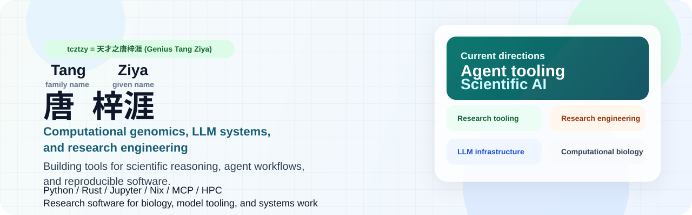

  

  
  
  
  

I build software at the intersection of LLM systems, developer tooling, compilers/runtimes, and scientific computing.

I care about tools that make complex workflows executable, inspectable, and benchmarkable.

> I now work in full human-AI symbiosis: whether I am job hunting, writing papers, or replying to emails, I stay synchronized with my private assistant. If my assistant and I cannot reach agreement on a product—whether by the assistant convincing me to revise it or by me convincing the assistant to accept my taste—I will not promote it. **Anything that an AI can already identify problems with does not deserve to waste human attention.**

- Working on agent skills, MCP servers, model-serving infrastructure, compiler/runtime projects, and evaluation tooling.
- Strongest with Python and Rust; usually shipping CLI tools, notebook tooling, and GPU/HPC-heavy workflows.
- Interested in software engineering, ML systems, and research engineering roles in Europe, the UK, and the US.

## Selected Work

<table>
  <tr>
    <td width="50%" valign="top">
      <b><a href="https://github.com/tcztzy/skills">skills</a></b> 
      Installable agent skills for Codex and Claude, with marketplace generation and local sync tooling.
    </td>
    <td width="50%" valign="top">
      <b><a href="https://github.com/tcztzy/swarmx">swarmx</a></b> 
      A lightweight multi-agent orchestration framework with MCP support and an OpenAI-compatible server.
    </td>
  </tr>
  <tr>
    <td width="50%" valign="top">
      <b><a href="https://github.com/tcztzy/yallm">yallm</a></b> 
      A high-performance API hub that maps between clients and multiple model providers with streaming-first compatibility.
    </td>
    <td width="50%" valign="top">
      <b><a href="https://github.com/tcztzy/xcc">xcc</a></b> 
      A modern Python C compiler focused on deterministic behavior, transparent diagnostics, and a clean architecture.
    </td>
  </tr>
  <tr>
    <td width="50%" valign="top">
      <b><a href="https://github.com/tcztzy/wenyan">wenyan</a></b> 
      A Python implementation of the Wenyan programming language with CLI tools, benchmarks, and a self-hosted path.
    </td>
    <td width="50%" valign="top">
      <b><a href="https://github.com/tcztzy/jupymcp">JupyMCP</a></b> 
      An MCP server for rich Jupyter notebook interaction, including cell editing, execution, and notebook resources.
    </td>
  </tr>
  <tr>
    <td width="50%" valign="top">
      <b><a href="https://github.com/tcztzy/miniprot-rs">miniprot-rs</a></b> 
      A Rust reimplementation of miniprot focused on clarity, maintainability, and performance, with room for embedding-augmented workflows.
    </td>
    <td width="50%" valign="top">
      <b><a href="https://github.com/tcztzy/cotton2k">cotton2k</a></b> 
      A Rust rewrite of an established scientific simulation model with Python bindings and batch workflows.
    </td>
  </tr>
</table>

## Right Now

- Hardening `yallm` and `swarmx` around provider compatibility, streaming, tool use, and MCP-native workflows.
- Building notebook and local-agent tooling through `jupymcp`, `skills`, and related projects.
- Working on language/toolchain projects such as `wenyan` and `xcc`.
- Exploring benchmark and evaluation workflows, including domain-specific reasoning tasks.

## Toolbelt

  
  
  
  
  
  
  
  

## Elsewhere

- Resume: [tcztzy/resume](https://github.com/tcztzy/resume)
- Notes and references: [tcztzy/bubble](https://github.com/tcztzy/bubble)
- GitHub profile: [@tcztzy](https://github.com/tcztzy)
- Contact: [tcztzy@gmail.com](mailto:tcztzy@gmail.com)
